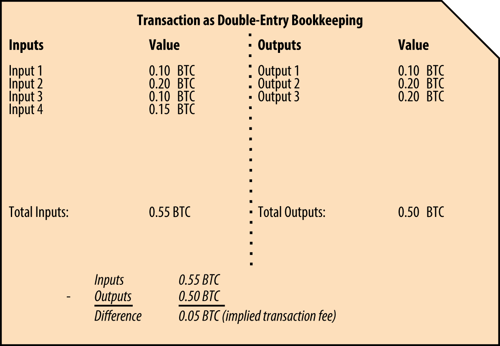

- [BitCoin](#bitcoin)
    - [白皮书概念整理](#)
        - [时间戳服务器(Timestamp server)](#timestamp-server)
        - [工作量证明（Proof-of-Work）](#proof-of-work)
        - [运行机制](#)
        - [区块](#)
    - [相关要点整理](#)
        - [比特币交易](#)
            - [创建交易](#)
            - [比特币地址](#)
            - [私钥格式](#)
            - [公钥格式](#)
            - [钱包](#)
        - [比特币交易在网络中的传播](#)
        - [交易结构](#)
        - [交易的输出和输入](#)
            - [交易输出](#)
            - [交易输入](#)
        - [交易脚本](#)
            - [标准交易类型](#)
- [共识机制](#)
    - [POW](#pow)
    - [POS](#pos)
    - [PBFT](#pbft)
        - [流程](#)
    - [优缺点](#)
- [分类](#)
    - [公链](#)
    - [联盟链](#)
    - [私有链](#)
    - [侧链](#)
- [问题](#)
    - [比特币中的区块记录的交易账单是什么？这些交易账单由谁产生？十分钟才能确认，那么十分钟内不是得等着？](#)
    - [一个区块包含多少交易账单？为什么区块每十分钟产生一个，由谁控制？](#)
    - [当前区块没有被矿工挖出来怎么办？](#)
    - [两个节点同时广播不同记录，链分叉了如何处理，具体的？](#)
    - [★结点下线一段时间后再上线，如何同步数据？直接copy过来么？结点下线后是否影响算力呢？如果大部分节点下线，那么当前全网算力下降，是否更容易被攻击篡改呢？](#copy)
    - [区块结构到底是什么样子的？只有merkle tree的root么？](#merkle-treeroot)

# BitCoin


比特币系统由**用户**（用户通过密钥控制钱包）、**交易**（每一笔交易都会被广播到整个比特币网络）和**矿工**（通过竞争计算生成在每个节点达成共识的区块链，区块链是一个分布式的公共权威账簿，包含了比特币网络发生的所有的交易）组成。 

下面就白皮书中的关键点和具体原理进行整理与解析。

## 1. 白皮书概念整理
### 1.1 账户/地址
比特币采用了非对称的加密算法，用户自己保留私钥，对自己发出的交易进行签名确认，并公开公钥。比特币的账户地址其实就是用户公钥经过一系列 Hash（HASH 160，或先进行 SHA256，然后进行 RIPEMD160）及编码运算后生成的 160 位（20 字节）的字符串。   

一般地，对账户地址串进行 Base58Check 编码，并添加前导字节（表明支持哪种脚本）和 4 字节校验字节，以提高可读性和准确性。

### 1.2 交易
交易是完成比特币功能的核心概念，一条交易可能包括如下信息：
* 付款人地址：合法的地址，公钥经过 SHA256 和 RIPEMD160 两次 Hash，得到160位 Hash 串；
* 付款人对交易的签字确认：确保交易内容不被篡改；
* 付款人资金的来源交易 ID ：哪个交易的输出作为本次交易的输入；
* 交易的金额：多少钱，与输入的差额为交易的服务费；
* 收款人地址：合法的地址；
* 收款人的公钥：收款人的公钥；
* 时间戳：交易何时能生效。

网络中节点收到交易信息后，将进行如下检查：
* 交易是否已经处理过；
* 交易是否合法，包括地址是否合法、发起交易者是否是输入地址的合法拥有者、是否是 UTXO;
* 交易的输入之和是否大于输出之和。
如果检查都通过，则将交易标记为合法的未确认交易，并在网络内进行广播。用户可以从 blockchain.info 网站查看实时的交易信息，一个示例交易的内容如下图所示。


### 1.3 交易脚本
脚本（script）是保障交易完成（主要用于检验交易是否合法）的核心机制，当所依附的交易发生时被触发。通过脚本机制而非写死交易过程，比特币网络实现了一定的可扩展性。

一般每个交易都会包括两个脚本：**输出脚本**（scriptPubKey）和 **认领脚本**（scriptSig）。输出脚本一般由付款方对交易设置锁定，用来对能动用这笔交易输出（例如，要花费交易的输出）的对象（收款方）进行权限控制，例如限制必须是某个公钥的拥有者才能花费这笔交易。认领脚本则用来证明自己可以满足交易输出脚本的锁定条件，即对某个交易的输出（比特币）的拥有权。

输出脚本目前支持两种类型：
* P2PKH : Pay-To-Public-Key-Hash ，允许用户将比特币发送到一个或多个典型的比特币地址上（证明拥有该公钥），前导字节一般为 OxOO;
* P2SH : Pay-To-Script-Hash ，支付者创建一个输出脚本，里边包含另一个脚本（认领脚本）的哈希，一般用于需要多人签名的场景，前导字节一般为 Ox05。

### 1.4 区块
比特币区块链的一个区块主要包括如下内容：
*  4 字节的区块大小信息；
*  80 字节的区块头信息；
* 交易个数计数器： 1 ～ 9 字节；
* 所有交易的具体内容，可变长 。

其中，区块头信息十分重要，包括：
* 版本号： 4 字节；
* 上一个区块头的 SHA256 Hash 值：链接到一个合法的块上， 32 字节；
* 包含所有验证过的交易的 Merkle 树根的哈希值， 32 字节；
* 时间戳： 4 字节；
* 难度指标： 4 字节；
* Nonce: 4 字节， PoW 问题的答案 。

```cpp
class CBlock
{
public:
    // header
    int nVersion;
    uint256 hashPrevBlock;
    uint256 hashMerkleRoot;
    unsigned int nTime;
    unsigned int nBits; // 记录本区块难度
    unsigned int nNonce;

    // network and disk
    vector<CTransaction> vtx;

    // memory only
    mutable vector<uint256> vMerkleTree;

};
```

当用户发布交易后，需要有人将交易进行确认，写到区块链中，形成新的区块。     
目前，每 10 分钟左右生成一个不超过 1 MB 大小的区块（记录了这 10 分钟内发生的验证过的交易内容），串联到最长的链尾部，**每个区块的成功提交者可以得到系统 12.5 个比特币的奖励**（一定区块数后才能使用），以及用户附加到交易上的支付服务费用。

比特币协议还规定，每四年新币的开采量减半，同时限制比特币的最终开采总量为2,100万枚。这样，流通中的比特币数量非常接近一条曲线，并将在2140年比特币将达到2,100万枚。由于比特币的开采速度随时间递减，从长期来看，比特币是一种通货紧缩货币。此外，不能通过“印刷”新比特币来实现“通货膨胀”。

### 1.5 时间戳服务器（Timestamp server）
* 时间戳服务器通过对`以区块(block)形式`存在的一组数据实施随机散列而加上时间戳，并将该随机散列进行广播。
* 该时间戳能够证实特定数据必然于某特定时间是的确存在的，因为只有在该时刻存在了才能获取相应的随机散列值。
* 每个时间戳应当将前一个时间戳纳入其随机散列值中，每一个随后的时间戳都对之前的一个时间戳进行增强(reinforcing)，这样就形成了一个`链条(Chain)`。

### 1.6 工作量证明（Proof-of-Work）
>在区块中补增一个随机数(Nonce)，这个随机数要使得该给定区块的随机散列值出现了所需的那么多个0。我们通过反复尝试来找到这个随机数，直到找到为止，这样我们就构建了一个工作量证明机制。  

区块中的随机数会影响生成的区块的hash值，而只有当这个hash值的前10位都是0时，才是有效的。需要耗费大量的cpu（随机碰撞）才能找到满足hash条件的随机数，这就是工作量。

>由于之后的区块是链接在该区块之后的，所以**想要更改该区块中的信息，就还需要重新完成之后所有区块的全部工作量**。  

工作量证明机制的本质则是`一CPU一票`。“大多数”的决定表达为最长的链，因为最长的链包含了最大的工作量。如果大多数的CPU为诚实的节点控制，那么诚实的链条将以最快的速度延长，并超越其他的竞争链条。  

工作量证明的难度(the proof-of-work difficulty)将采用移动平均目标的方法来确定，即令难度指向令每小时生成区块的速度为某一个预定的平均数。如果区块生成的速度过快，那么难度就会提高。

### 1.7 运行机制
1) 新的交易向全网进行广播；
2) 每一个节点都将收到的交易信息纳入一个区块中；
3) 每个节点都尝试在自己的区块中找到一个具有足够难度的工作量证明；
4) **当一个节点找到了一个工作量证明，它就向全网进行广播**；
5) **当且仅当包含在该区块中的所有交易都是有效的且之前未存在过的，其他节点才认同该区块的有效性**；
6) 其他节点表示他们接受该区块，而表示接受的方法，**则是在跟随该区块的末尾，制造新的区块以延长该链条，而将被接受区块的随机散列值视为先于新区快的随机散列值**。

如果有两个节点同时广播不同版本的新区块，那么其他节点在接收到该区块的时间上将存在先后差别。  
他们将在率先收到的区块基础上进行工作，但也会保留另外一个链条。  

todo: 该僵局（tie）的打破要等到下一个工作量证明被发现？how？


## 2. 《精通比特币》相关要点整理
- [ ] 区块链原理、设计与应用 第6章
- [ ] 第二版 http://book.8btc.com/books/6/masterbitcoin2cn/_book/ch02.html
- [ ] 第一版 http://book.8btc.com/books/1/master_bitcoin/_book/2/2.html


### 2.1 比特币交易
每一笔交易包含一个或多个“输入”，有一个或多个“输出”，这些输入和输出的总额不需要相等，当输出累加略少于输入量时，两者的差额就代表了一笔隐含的“矿工费”，这也是将交易放进账簿的矿工所收集到的一笔小额支付。



交易是将钱从交易输入移至输出。**输入是指钱币的来源**，通常是之前一笔交易的输出。**交易的输出**则是通过**关联一个密钥**的方式**将钱赋予一个新的所有者**。一笔交易的输出可以被当做另一笔新交易的输入，这样随着钱从一个地址被移动到另一个地址的同时形成了一条所有权链。 


Alice的密钥提供了解锁之前交易输出的签名，因此向比特币网络证明她拥有这笔钱。她将咖啡的支付附到Bob的地址上，实现“阻止”那笔输出，指明要求是Bob签名才能消费这笔钱。


很重要的一点是，钱包应用甚至可以在完全离线时建立交易。就像在家里写张支票，之后放到信封发给银行一样，比特币交易**建立和签名**时不用连接比特币网络。只有在 **执行交易时**才需要将交易发送到网络。

#### 2.1.2 创建交易
##### 获取正确的输入  
完整客户端含有整个区块链中所有交易的所有未消费输出副本。这使得钱包既能拿这些输出构建交易，又能在收到新交易时很快地验证其 **输入**是否正确。然而，完整客户端占太大的硬盘空间，所以大多数钱包使用轻量级的客户端，只保存用户自己的未消费输出。
 
如果钱包客户端没有某一未消费交易输出，它可以通过不同的服务者提供的各种API或完整索引节点的JSON PRC API从比特币网络中拿到这一交易信息。

##### 创建交易输出  
交易的 **输出**会被创建成为一个包含这笔数额的脚本的形式，只能被引入这个脚本的一个解答后才能兑换。简单点说就 是，Alice的交易输出会包含一个脚本，这个脚本说 “这个输出谁能拿出一个签名和Bob的公开地址匹配上，就支付给谁”。

##### 将交易放到总账簿中
交易包含了确认资金所有权和分配给新所有者所需要的全部信息。现在，这个交易必须要被传送到比特币网络中以成为分布式账簿（区块链）的一部分


查看我们钱包中所有剩余的从之前交易中已确认的支出  
```shell
$ bitcoin-cli listunspent
[
    { 
        "txid" : "9ca8f969bd3ef5ec2a8685660fdbf7a8bd365524c2e1fc66c309acbae2c14ae3",
        "vout" : 0,
        "address" : "1hvzSofGwT8cjb8JU7nBsCSfEVQX5u9CL",
        "account" : "",
        "scriptPubKey" : "76a91407bdb518fa2e6089fd810235cf1100c9c13d1fd288ac",
        "amount" : 0.05000000,
        "confirmations" : 7
    } 
]
```
交易`9ca8f969bd3ef5ec2a8685660fdbf7a8bd365524c2e1fc66c309acbae2c14ae3`转移了0.05BTC到地址`1hvzSofGwT8cjb8JU7nBsCSfEVQX5u9CL`。下面把0.05BTC一部分交易到新地址`1LnfTndy3qzXGN19Jwscj1T8LR3MVe3JDb`，一部分找零。  
```shell
$ bitcoin-cli createrawtransaction '[{"txid" : "9ca8f969bd3ef5ec2a8685660fdbf7a8bd365524c2e1fc66c309acbae2c14ae3", "vout" : 0}]' '{"1LnfTndy3qzXGN19Jwscj1T8LR3MVe3JDb": 0.025, "1hvzSofGwT8cjb8JU7nBsCSfEVQX5u9CL": 0.0245}'

0100000001e34ac1e2baac09c366fce1c2245536bda8f7db0f6685862aecf53ebd69f9a89c0000000000ffffffff02a0252600000000001976a914d90d36e98f62968d2bc9bbd68107564a156a9bcf88ac50622500000000001976a91407bdb518fa2e6089fd810235cf1100c9c13d1fd288ac00000000
```
`createrawtransaction`命令产生了一个原始十六进制字符串，其中编码了这笔交易的诸多细节。以上只是**创建**了交易，还需要**签名**交易，签名用以证明**我们拥有未花费的输出的来源地址的所有权**。使用`signrawtransaction`命令签名交易后会得到另一串十六进制的字符串，签名可以让这笔交易被比特币交易网络中的任何节点验证，使他们变得可靠。

支付比特币时，比特币的当前所有者需要在交易中提交其公钥和签名（每次交易的签名都不同，但均从同一个私钥生成）。比特币网络中的所有人都可以通过所提交的公钥和签名进行验证，并确认该交易是否有效，即确认支付者在该时刻对所交易的比特币拥有所有权。

#### 比特币地址
比特币地址可由公钥经过单向的加密哈希算法得到，一般作为收款方。比特币地址可以代表一对公钥和私钥的所有者，也可以代表其它东西，比如付款脚本。  


#### 私钥格式
*  Hex: 64 hexadecimal digits
*  WIF: Base58Check encoding: Base58 with version prefix of 128 and 32-bit checksum
*  WIF-compressed: As above, with added suffix 0x01 before encoding

私钥是非压缩的，也不能被压缩。“压缩的私钥”实际上只是表示“用于生成压缩格式公钥的私钥”，而“非压缩格式私钥”用来表明“用于生成非压缩格式公钥的私钥”。

#### 公钥格式
公钥是在椭圆曲线上的一个点，由一对坐标（x，y）组成。公钥通常表示为前缀04紧接着两个256比特的数字。其中一个256比特数字是公钥的x坐标，另一个256比特数字是y坐标。前缀04是用来区分非压缩格式公钥，压缩格式公钥是以02或者03开头。

#### 钱包
钱包是私钥的容器，可以分为非确定性（随机）钱包（随机生成私钥）和确定性（种子）钱包。对于确定性钱包，在这里你可以用原先的私钥，通过单向哈希函数来生成每一个新的私钥，并将新生成的密钥按顺序连接。只要你可以重新创建这个序列，你只需要第一个私钥（称作种子、主私钥）来生成它们。


### 比特币交易在网络中的传播
一旦一笔比特币交易被发送到任意一个连接至比特币网络的节点，这笔交易将会被该节点验证。如果交易被验证有效，该节点将会将这笔交易传播到这个节点所连接的其他节点；同时，交易发起者会收到一条表示交易有效并被接受的返回信息。如果这笔交易被验证为无效，这个节点会拒绝接受这笔交易且同时返回给交易发起者一条表示交易被拒绝的信息。为了避免垃圾信息的滥发、拒绝服务攻击或其他针对比特币系统的恶意攻击，每一个节点在传播每一笔交易之前均进行独立验证。 

### 交易结构
一笔比特币交易是一个含有输入值和输出值的数据结构，该数据结构植入了将一笔资金从初始点（输入值）转移至目标地址（输出值）的代码信息。比特币交易的输入值和输出值与账号或者身份信息无关。你应该将它们理解成一种被特定秘密信息锁定的一定数量的比特币。**只有拥有者或知晓这个秘密信息的人可以解锁**。
| 大小    | 字段     | 描述                   |
| ------- | -------- | ---------------------- |
| 4字节   | 版本     | 明确这笔交易参照的规则 |
| 1-9字节 | 输入数量 | 被包含的输入的数量     |
| 1-9字节 | 输出数量 | 被包含的输出的数量     |
| 不定    | 输出     | 一个或多个交易输出     |
| 4字节   | 时钟时间 | 一个UNIX时间戳或区块号 |

>交易的锁定时间   
>锁定时间定义了能被加到区块链里的最早的交易时间。在大多数交易里，它被设置成0，用来表示立即执行。如果锁定时间不是0并且小于5亿，就被视为区块高度，意指在这个指定的区块高度之前，该交易没有被包含在区块链里。如果锁定时间大于5亿，则它被当作是一个Unix纪元时间戳（从1970年1月1日以来的秒数），并且在这个指定时点之前，该交易没有被包含在区块链里。锁定时间的使用相当于将一张纸质支票的生效时间予以后延。

### 交易的输出和输入
比特币交易的基本单位是**未经使用的一个交易输出**，简称UTXO。UTXO是不能再分割、被所有者锁住或记录于区块链中的并被整个网络识别成货币单位的一定量的比特币货币。当一个用户接收比特币时，金额被当作UTXO记录到区块链里。这样，**一个用户的比特币会被当作UTXO分散到数百个交易和数百个区块中**。实际上，并不存在储存比特币地址或账户余额的地点，只有被所有者锁住的、分散的UTXO。**比特币钱包通过扫描区块链并聚合所有属于该用户的UTXO来计算该用户的余额**。

>在比特币的世界里既没有账户，也没有余额，只有分散到区块链里的UTXO。

尽管UTXO可以是任意值，但只要它被创造出来了，就像不能被切成两半的硬币一样不可再分了。如果一个UTXO比一笔交易所需量大，它仍会被当作一个整体而消耗掉，但同时会在交易中生成零头（找零）。**被交易消耗的UTXO被称为交易输入，由交易创建的UTXO被称为交易输出**。一笔比特币交易通过**使用所有者的签名来解锁UTXO**，并通过**使用新的所有者的比特币地址来锁定并创建UTXO**。给某人发送比特币实际上是创造新的UTXO，注册到那个人的地址，并且能被他用于新的支付。

#### 交易输出
*  交易输出包含两部分：

1.  一定量的比特币，被命名为“聪”，是最小的比特币单位； 
2.  一个锁定脚本，也被当作是“障碍”，提出支付输出所必须被满足的条件以“锁住”这笔总额。

锁定脚本会把输出锁在一个特定的比特币地址上，从而把一定数量的比特币的所有权转移到新的所有者上。比如Alice转给Bob0.015BTC，当Bob选择使用这笔款项进行支付时，他的交易会释放障碍，通过提供一个包含Bob私钥的解锁脚本来解锁输出。

#### 交易输入
交易输入是指向UTXO的指针。若想支付UTXO，一个交易的输入也需要包含一个解锁脚本，用来满足UTXO的支付条件。解锁脚本通常是一个签名，用来证明对于在锁定脚本中的比特币地址拥有所有权。

一个计算会被发送的比特币总量的脚本（贪心算法）在例中，可用的UTXO被提供在一个常数数组中。但在实际中，可用的UTXO被一个远程过程调用比特币核心，或者被一个如例5-1中的第三方应用程序接*，来检索出来。
```python
# 使用贪心算法从UTXO列表中选择输出。

from sys import argv 

class OutputInfo: 

    def __init__(self, tx_hash, tx_index, value): 
        self.tx_hash = tx_hash
        self.tx_index = tx_index
        self.value = value 

    def __repr__(self):
        return "<%s:%s with %s Satoshis>" % (self.tx_hash, self.tx_index, 
                                            self.value) 

# 为了发送，从未花费的输出列表中选出最优输出。
# 返回输出列表，并且把其他的改动发送到改变地址。
def select_outputs_greedy(unspent, min_value): 
    # 如果是空的话认为是失败了。
    if not unspent: return None 
    # 分割成两个列表。
    lessers = [utxo for utxo in unspent if utxo.value < min_value]     
    greaters = [utxo for utxo in unspent if utxo.value >= min_value] 
    key_func = lambda utxo: utxo.value
    if greaters: 
        # 非空。寻找最小的greater。
        min_greater = min(greaters)
        change = min_greater.value - min_value 
        return [min_greater], change 
    # 没有找到greaters。重新尝试若干更小的。
    # 从大到小排序。我们需要尽可能地使用最小的输入量。
    lessers.sort(key=key_func, reverse=True)
    result = []
    accum = 0
    for utxo in lessers: 
        result.append(utxo)
        accum += utxo.value
        if accum >= min_value: 
            change = accum - min_value
            return result, "Change: %d Satoshis" % change 
    # 没有找到。
    return None, 0 

def main(): 
    unspent = [ 
        OutputInfo("ebadfaa92f1fd29e2fe296eda702c48bd11ffd52313e986e99ddad9084062167", 1,  8000000),
        OutputInfo("6596fd070679de96e405d52b51b8e1d644029108ec4cbfe451454486796a1ecf", 0, 16050000),
        OutputInfo("b2affea89ff82557c60d635a2a3137b8f88f12ecec85082f7d0a1f82ee203ac4", 0,  10000000),
        OutputInfo("7dbc497969c7475e45d952c4a872e213fb15d45e5cd3473c386a71a1b0c136a1", 0, 25000000),
        OutputInfo("55ea01bd7e9afd3d3ab9790199e777d62a0709cf0725e80a7350fdb22d7b8ec6", 17, 5470541),
        OutputInfo("12b6a7934c1df821945ee9ee3b3326d07ca7a65fd6416ea44ce8c3db0c078c64", 0, 10000000),
        OutputInfo("7f42eda67921ee92eae5f79bd37c68c9cb859b899ce70dba68c48338857b7818", 0, 16100000),
    ] 

    if len(argv) > 1:
        target = long(argv[1]) 
    else:
        target = 55000000 

    print "For transaction amount %d Satoshis (%f bitcoin) use: " % (target, target/ 10.0**8) 
    print select_outputs_greedy(unspent, target) 

if __name__ == "__main__": 
    main()
```
一旦UTXO被选中，钱包会为每个UTXO生成包含签名的解锁脚本，由此让它们变得可以通过满足锁定脚本的条件来被支付。钱包把这些UTXO作为参考，并且连同解锁脚本一起作为输入加到交易中。

交易费基于交易的尺寸，用千字节来计算，而不是比特币的价值。交易费不足或者没有交易费的交易可能会被推迟，基于尽力而为的原则在几个区块之后被处理，甚至可能根本不被处理。高交易费不是因为付的钱很多，而是因为她的交易很复杂并且尺寸很大——交易费是与参加交易的比特币值无关的。

### 交易脚本
比特币的交易验证引擎依赖于两类脚本来验证比特币交易：一个锁定脚本和一个解锁脚本。

**锁定脚本**是一个放在一个输出值上的“障碍”，同时它明确了今后花费这笔输出的条件。由于锁定脚本往往含有一个公钥（即比特币地址），在历史上它曾被称作一个脚本公钥代码。

**解锁脚本**是一个“解决”或满足被锁定脚本在一个输出上设定的花费条件的脚本，同时它将允许输出被消费。解锁脚本是每一笔比特币交易输出的一部分，而且往往含有一个被用户的比特币钱包（通过用户的私钥）生成的数字签名。由于解锁脚本常常包含一个数字签名，因此它曾被称作ScriptSig。

每一个比特币客户端会通过同时执行锁定和解锁脚本来验证一笔交易。对于比特币交易中的每一个输入，验证软件会先检索输入所指向的UTXO。这个UTXO包含一个定义了花费条件的锁定脚本。接下来，验证软件会读取试图花费这个UTXO的输入中所包含的解锁脚本，并执行这两个脚本。


首先，使用堆栈执行引擎执行解锁脚本。如果解锁脚本在执行过程中未报错（没有悬空操作符），主堆栈（非其它堆栈）将被复制。如果采用从解锁脚本处复制而来的数据执行锁定脚本的结果为真，那么解锁脚本就成功地满足了锁定脚本所设置的条件，因而，该输入是一个能使用该UTXO的有效授权。


UTXO是永久性地记录在区块链中的，因此它不会因一笔新交易所发起的无效尝试而变化或受影响。只有一笔有效的能准确满足UTXO条件的交易才会导致UTXO被标记为“已使用”，然后从有效的（未使用）UTXO集中所移除。

#### 标准交易类型
五大标准脚本分别为P2PKH、P2PK、MS（限15个密钥）、P2SH和OP_Return。


-------


[结点发现](https://github.com/yjjnls/blockchain-tutorial-cn/blob/master/doc/10.%E6%B7%B1%E5%85%A5%E5%8C%BA%E5%9D%97%E9%93%BE%E6%8A%80%E6%9C%AF%EF%BC%88%E4%BA%8C%EF%BC%89%EF%BC%9AP2P%E7%BD%91%E7%BB%9C.md#%E8%8A%82%E7%82%B9%E5%8F%91%E7%8E%B0)


# 共识机制
**共识机制一般用来保证分布式系统的一致性，`来对新增数据达成共识`。**    
对于要能容忍拜占庭错误的情况，一般包含PBFT系列、POW系列算法等。PBFT系列算法是确定的，一旦达成共识就不可逆转；而POW系列算法是不固定的，随着时间推移，被推翻的概率越来越小。    

在比特币中，指如何将全网交易数据客观记录并且不可篡改的过程。目前"三巨头"分别使用不同的共识算法（Consensus Algorithm）,比特币使用工作量证明PoW（Proof of Work），以太坊即将转换为权益证明PoS（Proof of Stake），比特股使用授权权益证明DPoS（Delegated Proof of Stake）。    

目前常用的几种共识机制     
## POW
通过计算来猜测一个数值（nonce），得以解决规定的 hash 问题。hash 问题具有不可逆的特点，因此，目前除了暴力计算外，还没有有效的算法进行解决。反之，如果获得符合要求的 nonce，则说明在概率上是付出了对应的算力。谁的算力多，谁最先解决问题的概率就越大。  

工作量证明机制(Proof of Work - PoW)是我们最熟知的一种共识机制。就如字面的解释，PoW就是工作越多，收益越大。这里的工作就是猜数字，谁能最快的猜出这个唯一的数字，谁就能做信息公示人。

## POS
类似现实生活中的股东机制，拥有股份越多的人越容易获取记账权。   

权益证明机制(Proof of Stake-PoS)也属于一种共识证明，它类似股权凭证和投票系统，因此也叫“股权证明算法”。由持有最多（token）的人来公示最终信息。

## PBFT
拜占庭共识算法(Byzantine Fault Tolerance- BFT)也是一种常见的共识证明。它与之前两种都不相同，BFT以计算为基础，也没有代币奖励。由链上所有人参与投票，少于（N-1）/3个节点反对时就获得公示信息的权利。**失效副本的数量不超过（n-1)/3**    

>拜占庭问题之所以难解，在于任何时候系统中都可能存在多个提案（因为提案成本很低），并且要完成最终的一致性确认过程十分困难，容易受干扰。但是一旦确认，即为最终确认。比特币的区块链网络在设计时提出了创新的 PoW（Proof of Work） 算法思路。一个是限制一段时间内整个网络中出现提案的个数（增加提案成本），另外一个是放宽对最终一致性确认的需求，约定好大家都确认并沿着已知最长的链进行拓宽。系统的最终确认是概率意义上的存在。这样，即便有人试图恶意破坏，也会付出很大的经济代价（付出超过系统一半的算力）。

### 流程
PBFT是一种状态机副本复制算法，即服务作为状态机进行建模，状态机在分布式系统的不同节点进行副本复制。每个状态机的副本都保存了服务的状态，同时也实现了服务的操作。   

1. 每个副本节点都包含了服务的整体状态，节点的日志包含了结点所接受的消息，并且包含当前的视图编号v（每一轮主节点的产生都会有一个新的v，递增，类似于raft中的term）
2. 主节点p收到客户端发来的消息m，向所有副本节点进行广播，进行三阶段协议
3. 所有副本都执行请求并将结果发回客户端
4. 客户端需要等待f+1个不同副本节点发回相同的结果，作为整个操作的最终结果。

如果客户端没有在有限时间内收到回复，请求将向所有副本节点进行广播。如果请求已经在副本节点处理过了，副本就向客户端重发一遍执行结果。如果请求没有在副本节点处理过，该副本节点将把请求转发给主节点。如果主节点没有将该请求进行广播，那么就有认为主节点失效，如果有足够多的副本节点认为主节点失效，则会触发一次视图变更。   

[ref](https://www.jianshu.com/p/fb5edf031afd)

## 优缺点
**共识算法的选择与应用场景高度相关，完全可信任的环境使用paxos 或者raft，对于联盟链这种带许可机制的可使用bft，完全公开的链就用是pow，pos，ripple共识等。**


PBFT需要结点之间相互通信，通信量是O(n^2)，不适合大规模，适合联盟链、私链。
PBFT还有个问题就是在运行之前节点必须固定并且互相知道。否则，就有可能有超过1/3的拜占庭节点，整个系统的安全性无法保证。这在public blockchain的环境下基本不可能做到的。

比特币共识不需要许可，而BFT算法需要许可（至少需要知道节点的数量和他们对应的公钥）

BFT算法可扩展性（scalability）差，比特币共识（包括POW，POS权益证明等）效率低且无法实现强一致性


# 分类
而根据所采用的共识机制的不同，区块链又分为不同的种类，每种链都有其特性和适用场合。

## 公链

公共链-真正的完全去中心的区块链，可以是pow或者pos
突出公平，这是我猜的~~~

用户不用注册就能匿名参与的链，无需授权就能访问网络的区块链。公链的任何区块对外公开，任何人都可以发送价值。比特币以太坊是著名公链，公链适合虚拟货币，电子商务互联网金融等领域。

## 联盟链

联盟链-行业内的可监管区块链，一般用BFT，例如fabric
突出监管和安全，这也是我猜的~~~

联盟链仅限于联盟成员参与，成员参与区块链运行需要按照规则获取读写记账的权限。成员需要注册才可使用。联盟链由机构成员共同维护，提供成员管理，认证，授权，监控，审计功能。由40多家银行参与的R3区块链联盟和Linux基金会成立的超级账本项目属于联盟链构架。联盟链适合机构间交易清算结算B2B场景，用于节省对账和清算成本，减少人为错误的发生。联盟链对安全性能要求比公链高。

## 私有链

私有链-机构内私有定制区块链

私有链仅在机构内使用，读写权，记账权由组织内自由定制。 私有链的价值主要是提供安全可追溯不可篡改自动执行的运算平台，必须先注册取得许可才可以访问和使用。 央行发行的数字货币就是私有链。

## 侧链

侧链-与比特币挂钩且能和比特币区块链交互的区块链

比特币的任何修改都会导致分叉，影响现有的比特币区块链，所以想要改进比特币比较困难。 一般来说要创建新的代币，是用比特币做基础重构一条链，然后在上面创建新的规则发行代币，并且`将代币的价格和比特币实时挂钩`。侧链是相对与比特币主链来说的，所有遵循侧链协议的区块链都是侧链。**侧链协议是指：`可以让比特币安全地从比特币主链转移到其他区块链，又可以从其他区块链安全地返回比特币主链的一种协议`。莱特币，达世币，zcash就是著名的侧链。**

侧链意味着比特币不仅可以在比特币区块链上流通，还可以在其他区块链上流通，其应用范围和应用前景会更加广泛；有创意的人们会研发出各种各样的应用以侧链协议与比特币主链对接，使得比特币这种基准自由货币的地位越加牢固。


# 问题
## 比特币中的区块记录的交易账单是什么？这些交易账单由谁产生？十分钟才能确认，那么十分钟内不是得等着？
  
## 一个区块包含多少交易账单？为什么区块每十分钟产生一个，由谁控制？  
客户端会根据区块的生成速度来控制生成难度，以便控制在平均10分钟生成一个区块，比如通过控制hash结果中0的个数。    
整个网络每产生2,106个区块后会根据之前2,106个区块的算力进行难度调整。
## 当前区块没有被矿工挖出来怎么办？  
## 两个节点同时广播不同记录，链分叉了如何处理，具体的？ 
>如果有两个节点同时广播不同版本的新区块，那么其他节点在接收到该区块的时间上将存在先后差别。当此情形，他们将在率先收到的区块基础上进行工作，但也会保留另外一个链条，以防后者变成最长的链条。该僵局（tie）的打破要等到下一个工作量证明被发现，而其中的一条链条被证实为是较长的一条，那么在另一条分支链条上工作的节点将转换阵营，开始在较长的链条上工作。
问题是另一条分支链上的节点怎么转换阵营？在另一条链上已经产生的区块怎么办？
## ★结点下线一段时间后再上线，如何同步数据？直接copy过来么？结点下线后是否影响算力呢？如果大部分节点下线，那么当前全网算力下降，是否更容易被攻击篡改呢？
    如果一个节点没有收到某特定区块，那么该节点将会发现自己缺失了某个区块，也就可以提出自己下载该区块的请求。
    如果是下线情况，那么……todo
## 区块结构到底是什么样子的？只有merkle tree的root么？


